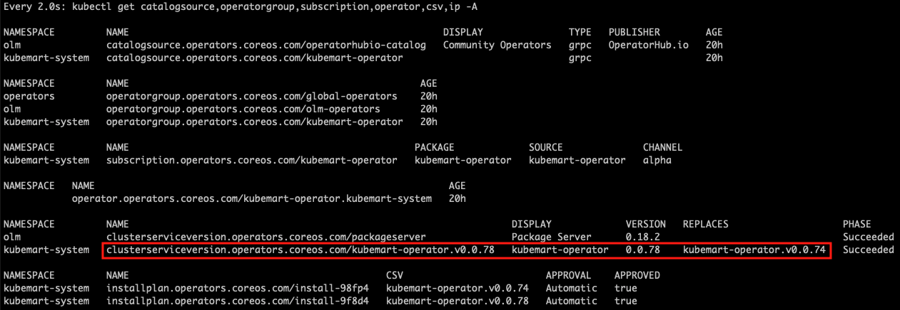

## OLM

### Background

For every release, we build OLM bundle and push the images to DockerHub:

- https://hub.docker.com/r/kubemart/kubemart-operator
- https://hub.docker.com/r/kubemart/kubemart-olm-bundle
- https://hub.docker.com/r/kubemart/kubemart-olm-index

Clusters that already [subscribed](olm-manifests.yaml) to Kubemart operator using OLM will automatically get updated to the latest version when they are available in DockerHub. This happens because the OLM operator will always run update "checks" in background - see `.spec.updateStrategy.registryPoll.interval` field in the `CatalogSource` YAML file.

In other words, cluster owner/admin doesn't have to manually update or run any `kubectl apply -f` commands to get the latest Kubemart operator in their cluster. Everything should be automatic.

### Troubleshooting

Sometimes, CI run for creating new release will get into issues which _may_ cause the Kubemart operator "auto upgrade" stop working. This rarely happen and usually caused by folders/files structure changes (something like [this](https://github.com/kubemart/kubemart-operator/pull/8)). Most of the time, the "auto upgrade" will take effect swiftly.

In the event when the "stuck" happen, what should you do?

Let's say the running operator in the cluster is v0.0.74 and you made a new release, v0.0.77. After waiting for the OLM operator to perform its recurring "checks" and the v0.0.74 operator doesn't get updated to v0.0.77, you should make a new release (v0.0.78) by following steps below:

1. Open _bundle/manifests/kubemart-operator.clusterserviceversion.yaml_ file

2. Change the `.spec.version` to the stuck version (e.g. 0.0.74) without `v` ([example commit](https://github.com/kubemart/kubemart-operator/commit/45b0617648120a73cefceb7a2d5a96147a6762dc))

3. Git commit and push that change to origin (refer to [release.md](release.md) for more details)

4. Create a new tag (e.g. v0.0.78) and push it to origin (refer to [release.md](release.md) for more details)

5. When CI run ends, you should see a new commit in origin ([example commit](https://github.com/kubemart/kubemart-operator/commit/7036aa5e2c40811962881a9c47942ca6af7abdd5))

6. Give some time to OLM operator to perform the update "checks" (see `.spec.updateStrategy.registryPoll.interval` field in the `CatalogSource` object inside your cluster)

7. If everything is fine, you should see something like this:

    

    That means, the "update path" for Kubemart operator has been corrected. All operators running at v0.0.74 will now get updated straight to v0.0.78 and skip all problematic versions in-between.
